# Turizm Acente Sistemi Projesi

## Giriş Bilgileri
Admin paneline ulaşmak için
Username: admin,
Password: 1234

Staff paneline ulaşmak için
Username: staff,
Password: 1234

## Proje Tanımı
Bu proje, otel odalarını dijital bir platformda rezerve etme ve yönetme süreçlerini otomatize etmeyi amaçlamaktadır.

## Projeden Beklentiler
- **Otel Yönetimi**: Otellerin sisteme eklenmesi, otel bilgilerinin tanımlanması (Ad, Adres, E-posta, Telefon, Yıldız, Tesis Özellikleri, Pansiyon Tipleri).
- **Dönem Yönetimi**: Otel dönemlerinin tanımlanması, fiyatlandırmanın dönemlere göre yapılması.
- **Oda Yönetimi**: Rezerve edilen odaların sisteme eklenmesi, oda özelliklerinin tanımlanması, oda fiyatlandırmasının yapılması.
- **Oda Arama ve Rezervasyon İşlemleri**: Müşterilerin sistemi kullanarak oda arama ve rezervasyon yapabilmesi, fiyat hesaplama.
- **Rezervasyon İşlemi**: Rezervasyonun tamamlanması (Müşteri iletişim bilgileri ile), stoğun güncellenmesi.
- **Rezervasyon Listesi**: Yapılan rezervasyonların listelenmesi.

## Kullanım Kılavuzu
Proje kullanımı için aşağıdaki adımları takip edebilirsiniz:

1. Projeyi bilgisayarınıza klonlayın veya indirin.
2. PostgreSQL veritabanını kurun.
3. IntelliJ IDEA veya benzeri bir IDE kullanarak proje dosyalarını açın.
4. `App.java` dosyasını bulup çalıştırarak projeyi başlatın.

## Teknik Gereksinimler
- Veritabanı: PostgreSQL
- GUI Tasarımı: Java Swing
- Kullanılan Teknolojiler: Java, JDBC ile veritabanı bağlantısı

## Proje Anlatımı
**Giriş Ekranı**

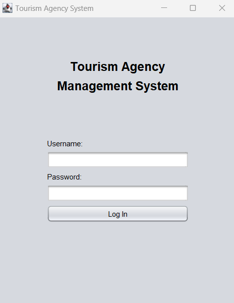

- Buradan Username ve Password ile giriş yapılmaktadır. 
- Admin rolüne sahip bir kullanıcı girişi yapıldığında Admin paneli, Staff rolüne sahip bir kullanıcı girişi yapıldığında Staff paneli açılmaktadır.
- Alanlar doldurulmadan Log In butonuna tıklandığında ve sistemde olmayan Username / Password girildiğinde uyarı mesajı vermektedir.

**Admin Ekranı**

**User Management**

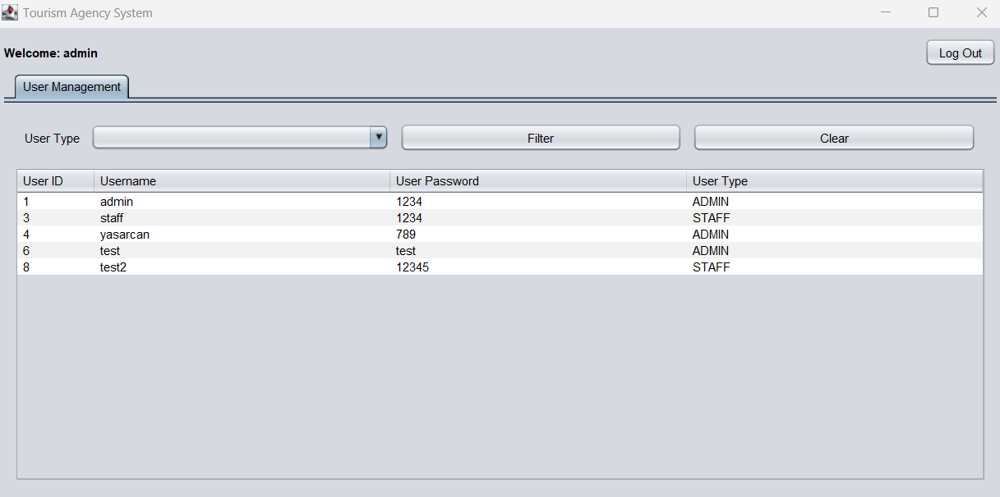

- Kullanıcıları kullanıcı tipine göre filtreleyebilirsiniz.
- Herhangi bir kullanıcı üzerinde sağ tıklayp yeni kullanıcı ekleyebilir, kullanıcıyı güncelleyebilir ve silebilirsiniz.

**Staff Ekranı**

**Hotel Management**

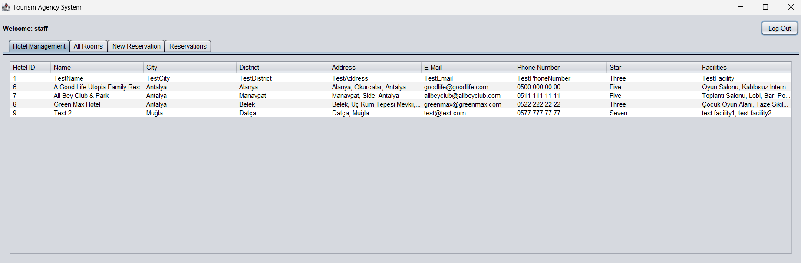

- Otel bilgilerini görebilirsiniz.
- Bir otelin üzerine sağ tıklayıp yeni otel ekleyebilir, oteli güncelleyebilir, silebilir ve "Hotel Details"ı seçip otel detaylarını ekleyip silebilirsiniz.

**Hotel Details**

**Hostel Type**

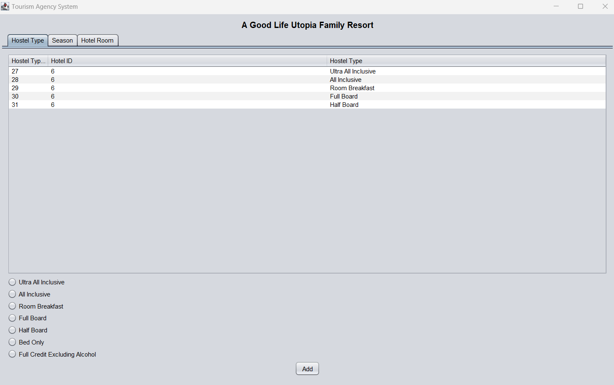

- Otelin sahip olduğu pansiyon tiplerini seçerek ekleyebilirsiniz.
- Bir otel tipinin üzerine sağ tıklayıp silebilirsiniz.
- Hiçbir seçim yapmadan Add butonu tıklanıldığında uyarı mesajı vermektedir.

**Season**

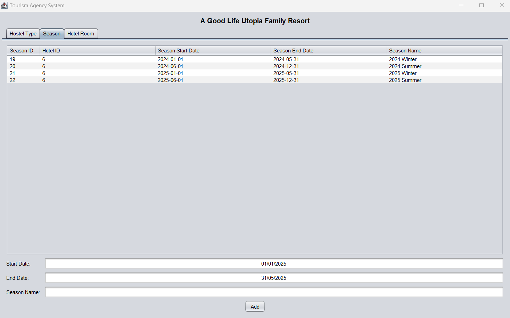

- Otelin sahip olduğu sezonları tarihlerini ve sezon adını girerek ekleyebilirsiniz.
- Bir sezonun üzerine sağ tıklayıp silebilirsiniz.
- Alanların doldurulması zorunludur, doldurulmadan Add butonuna tıklanıldığında uyarı mesajı vermektedir.

**Hotel Room**

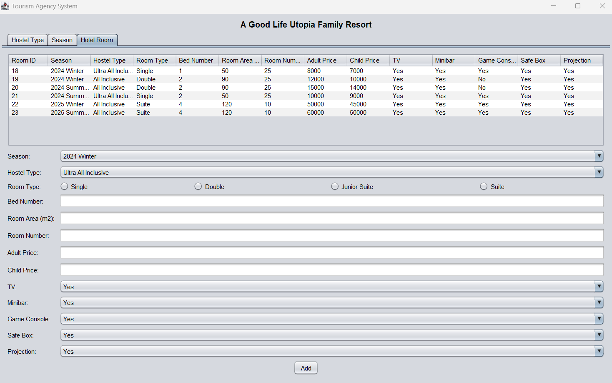

- Otelin sahip olduğu odaları sezonunu, pansiyon tipini, oda tipini, televizyon olup olmamasını, minibar olup olmamasını, oyun konsolu olup olmamasını, kasa olup olmamasını, projeksiyon olup olmamasını seçerek ve yatak sayısını, oda alanını, bu odadan kaç adet olduğunu, odanın yetişkin ve çocuk ücretlerini girerek ekleyebilirsiniz.
- Oda tipi seçimi yaparken radio butolardan sadece bir tanesi seçilecek şekilde gruplandırılmıştır.
- Alanların doldurulması zorunludur, doldurulmadan Add butonuna tıklanıldığında uyarı mesajı vermektedir.

**All Rooms**

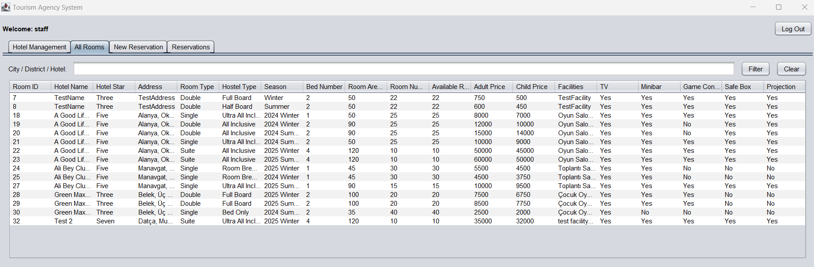

- Sisteme kayıtlı olan tüm odaları buradan görüntüleyebilirsiniz.
- Şehir, bölge veya otel adı girerek filtreleme yapılabilmektedir.
- Bu sekme sadece görüntüleme amaçlıdır.

**New Reservation**

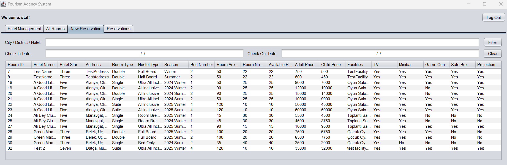

- Rezervasyon yapmak istediğiniz odanın üzerine sağ tıklayıp "Make a Reservation"ı seçerek rezervasyon ekleyebilirsiniz. 
- Rezervasyon yapmak için Check In ve Check Out tarihleri girilmek zorunludur, girilmeden rezervasyon yapılmaya çalışılırsa uyarı mesajı vermektedir.
- Tarihler girilip filtreleme yapıldığında o tarih aralığının dahil olduğu sezonlara ait odalar görüntülenmektedir. Böylelikle oda eklerken seçtiğimiz sezonda girilen yetişkin ve çocuk ücretlerine göre fiyatlandırma yapılabilmektedir.
- Oda rezervasyonu yapıldığında müsait oda sayısı (Available Room Number) rezervasyonun geçerli olduğu tarihler için azalmaktadır.
- Şehir, bölge veya otel adı girerek filtreleme yapılabilmektedir.

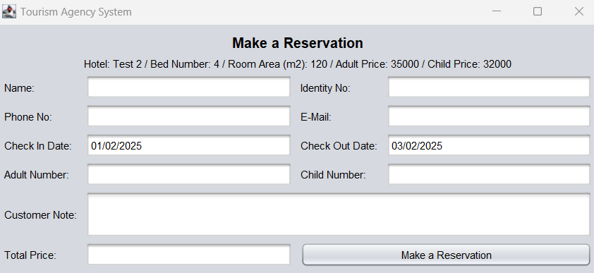

- Fiyatlandırma alanı (Total Price), rezervasyon yapılan gün sayısı, yetişkin sayısı - ücreti, çocuk sayısı - ücreti bilgilerine göre alanlar doldurulunca dinamik olarak hesaplanmaktadır. 
- Customer Note dışındaki alanların doldurulması zorunludur, doldurulmadan Make a Reservation butonuna tıklanıldığında uyarı mesajı vermektedir.

**Reservations**

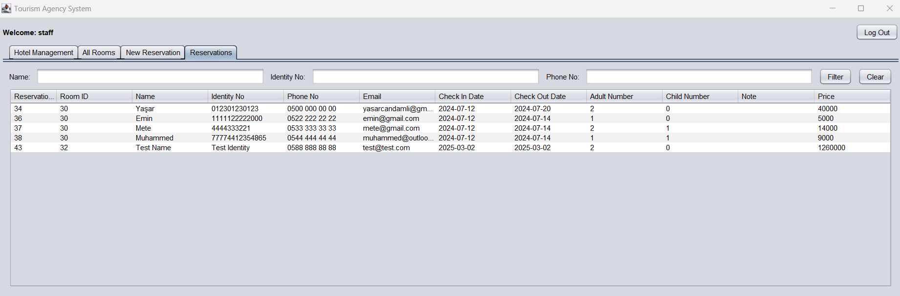

- Yapılan rezervasyonlar burada görüntülenmektedir.
- Ad, Kimlik No ve Telefon No girilerek filtreleme yapılabilmektedir.
- Bir rezervasyonun üzerine sağ tıklayıp rezervasyonu silebilir ya da güncelleyebilirsiniz.
- Rezervasyon silindiğinde rezervasyon tarihleri arasında New Reservation sekemsinde müsait oda sayısı (Available Room Number) otomatik olarak artmaktadır.

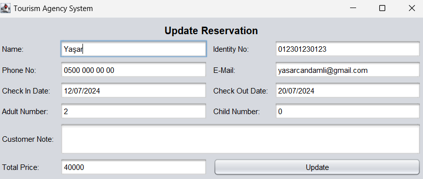

- Rezervasyonda bulunan İsim, Kimlik No, Telefon No, E-Mail, Adult Number, Child Number, Customer Note alanlarını güncelleyebilirsiniz.
- Customer Note dışındaki alanların doldurulması zorunludur, doldurulmadan Make a Reservation butonuna tıklanıldığında uyarı mesajı vermektedir.
- Fiyatlandırma alanı (Total Price), rezervasyon yapılan gün sayısı, yetişkin sayısı - ücreti, çocuk sayısı - ücreti bilgilerine göre alanlar doldurulunca dinamik olarak hesaplanmaktadır.